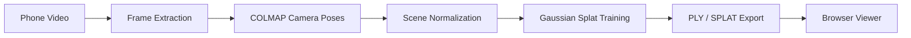

# MonoSplat

> Single-camera 3D Gaussian Splat reconstruction pipeline — record a video,
> run COLMAP for camera alignment, train with PyTorch + gsplat on GPU,
> view the photorealistic 3D scene in your browser. Zero desktop apps required.


---

## Project Context

MonoSplat was built as an engineering project to explore how modern 3D reconstruction can be made usable outside a research lab. The goal is not only to train a Gaussian Splat, but to design a complete workflow around it: video capture, preprocessing, camera pose estimation, scene normalization, GPU training, checkpointing, browser delivery, and future AI/XR extensions.

This repository is therefore written for two audiences:

| Audience | What they should get from this repo |
|----------|-------------------------------------|
| Evaluators / mentors | A clear engineering story: problem, design trade-offs, implementation choices, limitations, and next steps |
| New users / contributors | A practical path from phone video to browser-viewable 3D reconstruction, with enough background to understand the moving parts |
| Researchers / technical readers | Transparent Gaussian Splatting internals, config-driven training behavior, renderer choices, and reproducible pipeline stages |
| Builders / product teams | A foundation for local-first 3D capture, browser visualization, and future AI/XR experiences |

MonoSplat is intentionally not a black-box demo. It is a learning-oriented and production-minded codebase where the core system is inspectable, configurable, and explainable.

---

## Why This Project Exists

Most people can record high-quality video with a phone, but turning that video into an interactive 3D scene is still surprisingly fragmented. Typical workflows require separate tools for frame extraction, COLMAP, training, file conversion, and viewing. Commercial apps hide the pipeline behind a cloud service, while research code often assumes the user already knows the reconstruction stack.

MonoSplat connects those pieces into one understandable system:



The project is built around a simple question:

> Can a user capture a real object or scene with a normal camera and get an interactive, photorealistic 3D representation without installing a specialist desktop viewer?

Gaussian Splatting is the right fit because it gives the project a rare combination of:

- real-time rendering,
- high visual quality,
- explicit editable 3D primitives,
- fast training compared with NeRF-style methods,
- browser-friendly delivery through `.splat` assets.

---

## What Users Should Know First

Gaussian Splatting is not magic scene understanding and it is not a reusable model trained once for every object. Each trained output is specific to one captured scene.

| Concept | Plain-English explanation |
|---------|---------------------------|
| Input video | A normal phone video with enough overlap, texture, and stable exposure |
| COLMAP | The geometry stage that estimates camera positions and a sparse point cloud |
| Scene normalization | Rescales camera positions to the unit ball so training hyperparameters work at the right scale |
| Gaussian training | The optimization stage that turns sparse geometry into many colored 3D ellipsoids |
| `.ply` | A detailed point/Gaussian export useful for tools and inspection |
| `.splat` | A compact viewer-friendly asset for browser rendering |
| Checkpoints | Saved training states that allow recovery or resume |
| Browser viewer | The final interactive experience, built so users do not need a desktop 3D app |

The quality of the final splat depends heavily on capture quality. Good footage matters as much as good code: slow movement, strong overlap, textured surfaces, and consistent lighting will beat a shaky high-resolution video almost every time.

---

## Design Preferences

MonoSplat is designed with a few strong preferences that guide the codebase.

### 1. Repository as Source of Truth

Core logic belongs in the repository, not in notebooks or ad-hoc runtime scripts. Training behavior, renderer behavior, densification, pruning, initialization, optimizer schedules, and exports should be implemented in `src/` or `scripts/`, then orchestrated by notebooks or servers.

This keeps the project reproducible. A Colab notebook may launch training, mount Drive, upload datasets, and sync outputs, but it should not redefine the algorithm.

### 2. Browser-First Delivery

The final experience should be easy to open, inspect, and share. A browser viewer is preferred over desktop-only rendering because it lowers the barrier for users, mentors, and reviewers.

### 3. Config-Driven Behavior

Training parameters should come from repository config and code, not from hidden notebook cells. This makes experiments easier to compare and prevents runtime drift.

### 4. Graceful Hardware Scaling

The pipeline should work on a spectrum of machines:

- local CPU for preprocessing and debugging,
- local NVIDIA GPU for full training when available,
- Google Colab or cloud GPU for users without strong local hardware,
- software fallback for correctness/debugging when CUDA is not available.

### 5. Explainability Over Mystery

The README documents not just what to run, but why each choice exists. The project demonstrates engineering reasoning, not only code output.

---

## Hardware and Software Preferences

MonoSplat separates CPU-heavy preprocessing from GPU-heavy training.

| Stage | Preferred hardware | Why |
|-------|--------------------|-----|
| Video upload / serving | Any modern CPU | Mostly I/O and web server work |
| Frame extraction | CPU with FFmpeg | FFmpeg is mature, fast, and codec-friendly |
| Quality checks | CPU | OpenCV checks are lightweight compared with training |
| COLMAP feature extraction / matching | NVIDIA GPU preferred, CPU possible | GPU SIFT is faster, but COLMAP can still run on CPU |
| Scene normalization | CPU | Pure NumPy — instant regardless of scene size |
| Gaussian training | NVIDIA CUDA GPU strongly preferred | gsplat relies on CUDA for practical training speed |
| Browser viewing | Modern browser + GPU acceleration | Three.js/WebGL makes viewing zero-install |

### Recommended GPU Tiers

| GPU tier | Expected use |
|----------|--------------|
| Colab T4 / RTX 3060 class | Good baseline for demos and moderate scenes |
| L4 / RTX 3080 / RTX 4070+ | Better for higher Gaussian counts and faster iteration |
| A100 / RTX 4090 class | Best for large scenes, high resolution, and experimentation |
| CPU only | Useful for pipeline validation, not practical for full-quality training |

### Software Preferences

| Choice | Preference | Reason |
|--------|------------|--------|
| Rasterizer | `gsplat` first | Actively maintained CUDA kernels with clean Python API |
| Fallback renderer | Built-in PyTorch software path | Keeps the project debuggable without custom CUDA |
| Camera poses | COLMAP | Proven SfM pipeline with real geometry |
| Scene normalization | Custom NumPy module | Zero-dependency; runs on CPU before training begins |
| Viewer | Three.js / browser | Portable, shareable, no desktop installation |
| Runtime orchestration | Colab notebook or local script | Runtime setup stays separate from core implementation |

---

## Why Gaussian Splatting

Gaussian Splatting is chosen because it matches the product goal of MonoSplat: fast reconstruction into a real-time, inspectable 3D scene.

NeRF-style methods are powerful, but they usually render by querying a neural network many times per pixel. That makes real-time browser rendering harder. Gaussian Splatting instead stores the scene as explicit 3D Gaussians that can be projected and blended efficiently.

For this project, the deciding advantages are:

- **Real-time viewing:** users can orbit around the reconstructed scene smoothly.
- **Fast training loop:** practical on Colab or consumer GPUs.
- **Explicit scene representation:** the output is a set of editable primitives, not only hidden neural weights.
- **Viewer compatibility:** `.splat` assets can be loaded by web viewers and external tools.
- **Good project scope:** the method touches computer vision, graphics, deep learning, systems design, and web delivery in one coherent project.

Gaussian Splatting is not chosen because it is universally better than every 3D method. It is chosen because its trade-offs are especially strong for single-scene reconstruction and browser-first visualization.

---

## Repository Reading Guide

If you are reviewing the project quickly, start here:

| Need                      | Read / run                                                                               |
|---------------------------|------------------------------------------------------------------------------------------|
| Understand the full idea  | `README.md` sections: What Is MonoSplat, How Gaussian Splatting Works, Method Comparison |
| Run the full pipeline     | `scripts/pipeline.py`                                                                    |
| Run step by step          | `scripts/prepare_dataset.py` → `colab/train.py` → `colab/export_splat.py`               |
| Launch the web app        | `uvicorn backend.app.main:app --reload` + `npm run dev`                                  |
| Inspect model internals   | `src/reconstruction/gaussian_model.py`                                                   |
| Inspect training behavior | `src/reconstruction/trainer.py`                                                          |
| Inspect rendering choices | `src/renderer/renderer.py`                                                               |
| Inspect scene normalization | `src/preprocessing/normalize_scene.py`                                                 |
| Change training behavior  | `configs/config.yaml`                                                                    |

---

## Table of Contents

- [Project Context](#project-context)
- [Why This Project Exists](#why-this-project-exists)
- [What Users Should Know First](#what-users-should-know-first)
- [Design Preferences](#design-preferences)
- [Hardware and Software Preferences](#hardware-and-software-preferences)
- [Why Gaussian Splatting](#why-gaussian-splatting)
- [Repository Reading Guide](#repository-reading-guide)
- [What Is MonoSplat?](#what-is-monosplat)
- [How Gaussian Splatting Works](#how-gaussian-splatting-works)
- [3D Gaussian Splatting — Deep Dive](#3d-gaussian-splatting--deep-dive)
  - [Definition and Intuition](#definition-and-intuition)
  - [Mathematical Formulation](#mathematical-formulation)
  - [Optimization and Training](#optimization-and-training)
  - [Rendering Pipeline](#rendering-pipeline)
  - [Comparison to Other Methods](#comparison-to-other-methods)
  - [Known Implementations](#known-implementations)
  - [Benchmarks and Hardware](#benchmarks-and-hardware)
  - [Limitations and Future Directions](#limitations-and-future-directions)
  - [Algorithmic Pseudocode](#algorithmic-pseudocode)
- [Project Architecture](#project-architecture)
- [Codebase Structure](#codebase-structure)
- [Folder Reference](#folder-reference)
- [Design Deep-Dives](#design-deep-dives)
  - [GaussianModel (`src/reconstruction/gaussian_model.py`)](#gaussianmodel)
  - [GaussianTrainer (`src/reconstruction/trainer.py`)](#gaussiantrainer)
  - [Loss Functions (`src/reconstruction/loss.py`)](#loss-functions)
  - [Renderer (`src/renderer/renderer.py`)](#renderer)
  - [Camera (`src/renderer/camera.py`)](#camera)
  - [Frame Extraction (`src/preprocessing/extract_frames.py`)](#frame-extraction)
  - [COLMAP Runner (`src/preprocessing/colmap_runner.py`)](#colmap-runner)
  - [Scene Normalization (`src/preprocessing/normalize_scene.py`)](#scene-normalization)
- [Pipeline Stages in Detail](#pipeline-stages-in-detail)
- [Quick Start](#quick-start)
- [GPU Training](#gpu-training)
- [Configuration Reference](#configuration-reference)
- [Input Data Requirements](#input-data-requirements)
- [Capture Guide](#capture-guide)
- [Output Formats](#output-formats)
- [Troubleshooting](#troubleshooting)
- [Performance Targets](#performance-targets)
- [Tech Stack](#tech-stack)
- [Method Comparison](#method-comparison)
  - [Gaussian Splatting vs NeRF](#gaussian-splatting-vs-nerf)
  - [Why MonoSplat vs Other Pipelines](#why-monosplat-vs-other-pipelines)
  - [Software Renderer vs gsplat](#software-renderer-vs-gsplat)
- [Important Notes](#important-notes)
- [Future Scope](#future-scope)
- [References](#references)

---

## What Is MonoSplat?

MonoSplat is a **complete end-to-end pipeline** that transforms a single video — shot on any phone — into a photorealistic, navigable 3D scene viewable in any browser. No desktop rendering app, no OpenGL environment, no calibration rig.

```
Video Input  →  Frame Extraction  →  Camera Poses  →  Scene Normalization  →  Gaussian Training  →  Browser Viewer
   MP4/MOV         FFmpeg              COLMAP (SfM)     normalize_scene.py     PyTorch + gsplat       Three.js
```

### Pipeline Stack

| Stage | Tool | Why |
|-------|------|-----|
| Frame extraction | **FFmpeg** | Broad codec support (H.264/H.265/HEVC/ProRes), hardware-accelerated, faster than OpenCV |
| Camera alignment (SfM) | **COLMAP** | Geometry-based real camera poses — not neural approximations |
| Scene normalization | **Custom NumPy module** | Rescales camera positions to unit ball before training begins; prevents scale-induced gradient instability and splat explosion |
| Gaussian Splat training | **Custom PyTorch + gsplat** | GPU-accelerated with nerfstudio's actively-maintained CUDA kernels |
| Browser viewer | **Three.js** | Zero-install, cross-platform, real-time |
| Quality validation | **OpenCV + Custom** | Blur, motion, and exposure detection before COLMAP |

This pipeline is:
- **Geometry-based** — real camera poses from real footage, not neural approximations
- **Scale-normalized** — camera positions are normalized before training so hyperparameters work at a consistent scale
- **Single-camera** — works with standard phone video, no hardware depth sensors
- **Browser-native** — no desktop app installation required
- **Fully open source** — auditable, extensible, and reproducible

---

## How Gaussian Splatting Works

**Gaussian Splatting is fundamentally different from a normal trained ML model.** A conventional model is trained once and generalises to new inputs at inference time. Gaussian Splatting works in the opposite direction — the "model" is not a generalised neural network. It is a scene-specific set of 3D primitives that intentionally overfit to one particular captured environment.

```
Video A  →  COLMAP  →  Normalize  →  PyTorch train  →  scene_A.splat   (only encodes scene A)
Video B  →  COLMAP  →  Normalize  →  PyTorch train  →  scene_B.splat   (only encodes scene B)
```

There is no shared weights file. Every new video requires a new full training run. This is a property of the technology, not a limitation of this codebase.

### What Is a Gaussian?

Each 3D Gaussian is a small, oriented, semi-transparent ellipsoid in world space. The scene is the union of hundreds of thousands to millions of these ellipsoids. Every Gaussian has six learnable properties:

| Property | Shape | Description |
|----------|-------|-------------|
| Position | (N, 3) | World-space XYZ coordinates |
| SH coefficients (DC) | (N, 1, 3) | Base colour (zero-frequency spherical harmonic) |
| SH coefficients (rest) | (N, K−1, 3) | View-dependent colour variation (up to degree 3, 16 SH bands total) |
| Opacity | (N, 1) | How transparent the Gaussian is (stored as logit, activated with sigmoid) |
| Scale | (N, 3) | Size along each principal axis (stored as log, activated with exp) |
| Rotation | (N, 4) | Orientation as a unit quaternion |

The renderer sorts these by depth, projects each 3D covariance matrix to a 2D screen ellipse using the Jacobian of the perspective projection, then alpha-composites them back-to-front. Because every operation is differentiable, gradient-based optimisation can nudge position, scale, rotation, opacity, and colour to minimise the difference between the rendered image and the corresponding ground-truth captured frame.

---

## 3D Gaussian Splatting — Deep Dive

This section explains Gaussian Splatting from first principles. Whether you are new to 3D reconstruction or coming from a machine learning background, you should be able to read this top-to-bottom and understand exactly what is happening inside MonoSplat's training and rendering steps.

---

### Definition and Intuition

3D Gaussian Splatting represents a scene as a **set of 3D Gaussian ellipsoids**. Each Gaussian has a mean position, a full covariance matrix, a colour representation, and an opacity. Intuitively, each Gaussian acts like a soft "volumetric blob" that emits light: its density is highest at its centre and tapers off according to its covariance shape.

Compare this to the two other common approaches:

- **NeRF (Neural Radiance Fields)** uses an MLP to assign density and colour to every 3D point. This is expressive but requires querying the network many times per pixel during rendering, making it slow.
- **Point clouds** treat points as hard surface samples with no volume. They render fast but cannot represent translucent regions or smooth falloff.

Gaussian Splatting gives you the best of both worlds: a fuzzy volumetric representation that can model translucency and smooth shading, while being efficient enough to rasterize in real time without any MLP evaluation.

Because Gaussians are optimised in 3D space, empty regions stay empty — no computation is wasted on empty space. View-dependent colour (the way a surface looks different from different angles) is built in via spherical harmonics coefficients stored per Gaussian. The result is a differentiable, volumetric, real-time-renderable scene representation.

---

### Mathematical Formulation

#### Gaussian parameters

Each Gaussian `G_i` has:

- **Mean** `μ_i ∈ ℝ³` — the 3D world-space centre of the ellipsoid.
- **Covariance** `Σ_i` — a 3×3 positive-semi-definite matrix defining the ellipsoid's shape and orientation. In practice this is not stored directly. Instead it is parameterised as a **scale vector** `s_i = (s_x, s_y, s_z)` and a **rotation quaternion** `q_i`, giving `Σ_i = R_i · diag(s_i)² · R_i^T`. This ensures the matrix is always a valid ellipsoid and keeps optimisation stable.
- **Opacity** `α_i` — how transparent the Gaussian is (stored as a logit value, passed through a sigmoid during rendering).
- **Colour** — stored as spherical harmonic (SH) coefficients up to degree 3 (16 bands, 48 floats per Gaussian). Lower SH bands capture base colour; higher bands capture view-dependent variation like specular highlights.

#### Projecting a 3D Gaussian to 2D (splatting)

To render a view, each 3D Gaussian must be projected onto the image plane. Using a first-order Taylor expansion (the Jacobian `J` of the perspective projection), the 3D Gaussian in camera space maps to a 2D Gaussian ellipse on the screen. If `W` is the camera rotation matrix:

```
Σ_screen = J · W · Σ_i · W^T · J^T
```

Dropping the depth row and column from this result gives a 2×2 screen-space covariance. This is the shape of the "splat" — the ellipse drawn on the image for this Gaussian.

#### Alpha compositing (the rendering equation)

Once all Gaussians are projected, the pixel colour is computed by blending them front-to-back:

```
C = Σ_i  T_i · α_i · c_i

where  T_i = Π_{j < i} (1 - α_j)
```

`T_i` is the remaining transmittance (how much light still passes through after all closer Gaussians). `c_i` is the colour of Gaussian `i` for the current view direction (evaluated from its SH coefficients). `α_i` here is the product of the stored opacity and the 2D Gaussian weight at the current pixel. This is identical to the volumetric rendering equation used in NeRF — the difference is that 3DGS evaluates it by sorting and rasterizing explicit ellipsoids rather than by ray-marching through an MLP.

---

### Optimization and Training

#### Initialization

Training does not start from random noise. It starts from the **sparse point cloud produced by COLMAP** (Structure-from-Motion). Each 3D point becomes one initial Gaussian:

- Position `μ_i` = the COLMAP point position.
- Covariance set isotropically: each axis length equals the mean distance to the nearest neighbouring points.
- Colour set to the point's observed colour from the SfM images.
- Opacity set to a small constant.

This gives the optimiser a physically grounded starting configuration, which is why COLMAP output is a hard dependency.

#### Scene Normalization Before Training

After COLMAP runs and before training begins, camera positions are normalized to the unit ball by `src/preprocessing/normalize_scene.py`. The normalization:

1. Computes the centroid of all camera centres in world space.
2. Translates all cameras so the centroid is at the origin.
3. Divides by the 90th-percentile camera distance (robust to outlier cameras).
4. Writes `outputs/sparse/sparse_text/scene_norm.json` with the centroid and scale factor.

Without this step, large-scale scenes place cameras dozens of metres apart in world space. The densification threshold (`densify_grad_threshold`), position learning rate, and scale clamping in `export_splat.py` all assume unit-ball-scale geometry. Skipping normalization causes gradient instability, stretched geometry, and splat explosion.

#### Loss function

At each training iteration:

1. A random training camera and its ground-truth image are selected.
2. The scene is rasterized to produce a synthesized image.
3. The loss is computed:

```
L = ‖C_render - C_gt‖² + λ · D-SSIM(C_render, C_gt)
```

The first term is an L1/L2 pixel-wise difference. The second term is a structural similarity loss (D-SSIM) weighted by `λ` (0.2 in MonoSplat's config, matching the original 3DGS paper). No additional regularization is used. The optimizer (Adam) then backpropagates through the rasterization to update all Gaussian parameters.

#### Densification — the key adaptive step

Every `densification_interval` iterations (default: 500 in MonoSplat), the algorithm inspects each Gaussian's gradient magnitude with respect to its 2D screen-space position. A large gradient means the optimiser is trying to move the Gaussian significantly to reduce loss — which signals that region is under-reconstructed and needs more Gaussians.

Based on this, the algorithm does one of three things:

| Condition | Action |
|-----------|--------|
| Gradient is large **and** the Gaussian is small | **Clone** — duplicate the Gaussian nearby to fill the under-fit region |
| Gradient is large **and** the Gaussian is large | **Split** — divide it into two smaller Gaussians with the same coverage |
| Opacity falls below threshold, or size is excessive | **Prune** — remove the Gaussian entirely |

This adaptive densification is what lets the model start with a sparse point cloud and grow into a scene containing hundreds of thousands to millions of Gaussians, with density concentrated in the complex detailed areas that need it.

MonoSplat uses `gsplat`'s `meta["means2d"]` to read the exact 2D screen-space gradients as described in the original paper. The software fallback uses 3D position gradients as a proxy (less accurate but still functional).

Every `opacity_reset_interval` iterations (default: 1000), all opacities are reset to a small value. This forces the model to re-earn opacity from scratch, which prunes Gaussians that have drifted into positions where they are not actually contributing to any view.

#### Training schedule (MonoSplat defaults)

| Parameter | Value | Effect |
|-----------|-------|--------|
| `iterations` | 30,000 | Total gradient steps (12k on T4, 18k on L4 via tier preset) |
| `densify_from_iter` | 500 | Start densification after warm-up |
| `densify_until_iter` | 15,000 | Stop adding Gaussians (let the model converge) |
| `densification_interval` | 200 | How often to prune/clone |
| `densify_grad_threshold` | 0.0003 | Gradient magnitude that triggers clone/split |
| `max_gaussians` | 150,000 | Upper Gaussian count cap (80k on T4 via tier preset) |
| `opacity_reset_interval` | 1,000 | How often to reset opacities |
| `lambda_dssim` | 0.2 | SSIM loss weight (original 3DGS paper value) |
| `lambda_lpips` | 0.05 | Perceptual loss weight (active by default) |

---

### Rendering Pipeline

The rendering pipeline is designed around a custom GPU rasterizer. The full sequence is:

#### Step 1 — Frustum culling and projection

Gaussians whose bounding ellipsoid does not intersect the camera's view frustum are discarded immediately. For each surviving Gaussian:

- Its mean is projected to screen space (pixel coordinates).
- Its 3D covariance is projected through the Jacobian to produce a 2×2 screen-space covariance matrix.
- A 2D bounding box is computed around the resulting ellipse (radius ≈ 3 × sqrt of the largest eigenvalue of the 2×2 covariance, clamped to [1, 128] pixels).

#### Step 2 — Tile-based depth sorting

The screen is divided into tiles (typically 16×16 pixels). Each Gaussian is assigned to every tile its bounding box overlaps. A 64-bit sort key is constructed for each assignment:

```
key = (tile_index << 32) | encoded_depth
```

A single parallel radix sort over all keys gives a per-tile, depth-ordered list of Gaussians. This is the most expensive step and is where highly optimised GPU sort libraries matter.

#### Step 3 — Per-pixel alpha compositing

For each tile (processed in parallel), and for each pixel in the tile:

```python
T = 1.0   # transmittance starts fully transparent
colour = [0, 0, 0]

for each Gaussian in depth order (front to back):
    w = gaussian_2D_weight(pixel, μ_screen, Σ_screen)
    alpha_contribution = opacity * w
    colour += T * alpha_contribution * view_dependent_colour
    T *= (1 - alpha_contribution)
    if T < 0.001:
        break   # pixel is effectively opaque — stop early
```

The early exit when transmittance saturates is a significant performance saving for dense scenes.

#### Performance

On a modern NVIDIA GPU (RTX 3090 class), this pipeline achieves 100–200 FPS at 1080p for typical room-scale scenes. On a Colab T4, expect 30–60 FPS for moderate Gaussian counts. The rendering speed is why Gaussian Splatting is suitable for browser delivery — the `.splat` file can be consumed by a WebGL-based renderer in real time.

---

### Comparison to Other Methods

| Method | Image quality (PSNR) | Training time | Render speed | Memory (scene) | Notes |
|--------|----------------------|---------------|--------------|-----------------|-------|
| **Vanilla NeRF** | ~27–29 dB on real scenes | 48+ hours | ~0.06 FPS | Few MB (model) | Implicit MLP; slow everywhere |
| **Instant-NGP / Plenoxels** | ~33 dB on synthetic | 5–8 min | 10–15 FPS | 13–48 MB | Faster than NeRF but still far below real-time |
| **3D Gaussian Splatting** | ~27–29 dB real / ~33 dB synthetic | 5–40 min | **130–200 FPS** | 300–700 MB | Explicit; real-time; higher memory than NeRF |
| **Point cloud rendering** | Lower (no view-dependent shading) | None | Very high | Small (MBs) | Fast but no translucency or lighting effects |
| **Mesh / MVS** | Varies; good for Lambertian surfaces | Offline SfM/MVS | Very high | MBs–GBs | No view-dependent effects without texturing |

Key takeaway: 3DGS achieves NeRF-level image quality while rendering hundreds of times faster, at the cost of higher memory usage and a per-scene training requirement. There is no single global model — each scene is a fresh training run.

---

### Known Implementations

Several open-source implementations of 3D Gaussian Splatting exist:

- **graphdeco-inria/gaussian-splatting** — the official reference implementation from the SIGGRAPH 2023 paper authors. PyTorch + custom CUDA. The starting point for all serious study of the method.
- **nerfstudio-project/gsplat** — a high-performance reimplementation (JMLR 2025) with 4× less memory and ~15% faster training than the official code. pip-installable. This is what MonoSplat uses.
- **vkgs / 3DGS.cpp** — cross-platform C++/Vulkan real-time renderers for Windows, Linux, macOS, iOS, and visionOS.
- **Splatapult** — C++/OpenGL with OpenXR VR support.
- **Pointrix, GauStudio, DriveStudio** — framework-level wrappers integrating 3DGS with interactive visualization or multi-method benchmarking.

A curated list is maintained at the "awesome-3DGS" community repository.

---

### Benchmarks and Hardware

The SIGGRAPH 2023 paper evaluated 3DGS on three standard multi-view datasets:

- **Mip-NeRF360** — indoor and outdoor scene captures
- **Tanks & Temples** — high-quality object and structure scans
- **Deep Blending** — 360° panoramic captures

Representative numbers from the paper (30K iteration model, RTX 3090):

| Dataset | PSNR | SSIM | FPS | GPU memory |
|---------|------|------|-----|------------|
| Mip-NeRF360 | 27.2 dB | 0.815 | 134 | ~500 MB |
| Tanks & Temples | ~23.1 dB | 0.841 | 154 | ~411 MB |

Training time ranged from roughly 5–7 minutes for a coarse fit to 30–40 minutes for higher-quality convergence. By contrast, a comparable NeRF run on the same hardware takes approximately 48 hours.

On a **Colab T4** (what MonoSplat targets for free-tier GPU training), expect training times of 15–25 minutes at 18,000 iterations for a moderate scene.

---

### Limitations and Future Directions

Gaussian Splatting is a powerful method but it has real constraints to be aware of:

**Depth ordering artifacts.** The renderer sorts Gaussians once per frame. If a Gaussian moves through another during training, their depth ordering can flip, causing a brief visual pop. Fine-grained anti-aliasing and smooth depth blending are areas of active research.

**No explicit regularization.** The only training signal is photometric loss. Without additional constraints, Gaussians in poorly-viewed regions can become noisy or drift to floating positions. Depth priors (from LiDAR or monocular depth estimation) and shadow consistency losses are common extensions that address this.

**Scale limitations.** The method works best for room-scale or object-scale scenes. Very large or multi-scale scenes (a city block with both near details and far backgrounds) push against fixed learning rate schedules and memory limits. The original authors recommend tuning learning rates for large scenes. MonoSplat's scene normalization reduces — but does not eliminate — this sensitivity for very large captures.

**Memory cost scales with detail.** Each Gaussian carries roughly 60 floats (position, covariance, SH coefficients, opacity). A complex scene with one million Gaussians needs hundreds of megabytes of GPU memory. Pruning and cloning control growth, but there is a practical ceiling.

**Active research directions** include 4D Gaussian Splatting (dynamic scene capture), compression of Gaussian representations (fewer Gaussians, same perceptual quality), depth-regularized training, integration with real-time SLAM for live incremental reconstruction, and view-guided diffusion for reconstruction from sparse inputs.

---

### Algorithmic Pseudocode

These pseudocode listings show the full training and rendering loops in simplified form.

#### Training loop

```python
# Initialize from COLMAP sparse point cloud
Gaussians = initialize_from_SfM_points()
# Each Gaussian has: mean, isotropic covariance, colour, small opacity

# Normalize camera positions to unit ball (runs before this loop)
# scene_center, scene_scale = normalize_camera_positions(colmap_images)

for iteration in range(max_iterations):
    # Sample a random training camera and its ground-truth image
    camera, gt_image = sample_random_training_view()

    # Rasterize the current Gaussians into an image
    rendered_image = rasterize(Gaussians, camera)

    # Compute loss
    loss = L1(rendered_image, gt_image) + λ * DSSIM(rendered_image, gt_image)

    # Backpropagate gradients through all Gaussian parameters
    loss.backward()
    optimizer.step()   # Adam updates: position, scale, rotation, opacity, SH colour

    # Adaptive densification step
    if iteration % densify_interval == 0 and iteration < densify_until:
        for G in Gaussians:
            if G.opacity < min_alpha or G.world_size > max_size:
                Gaussians.remove(G)               # prune
            elif screen_gradient(G) > threshold:
                if G.is_large():
                    Gaussians.split(G)             # split into two smaller Gaussians
                else:
                    Gaussians.clone(G)             # duplicate nearby

    # Periodically reset opacities to prune drifted Gaussians
    if iteration % opacity_reset_interval == 0:
        Gaussians.reset_opacities_to_small_value()

    # Save training preview image every 500 iterations
    if iteration % 500 == 0:
        preview = rasterize(Gaussians, first_training_camera)
        save_preview(preview, f"previews/preview_{iteration:06d}.png")
```

#### Rasterization loop

```python
def rasterize(Gaussians, camera):
    # 1. Cull and project each Gaussian
    screen_gaussians = []
    for G in Gaussians:
        if not in_view_frustum(G, camera):
            continue
        mu_screen = project_to_pixels(G.mean, camera)
        cov_screen = project_covariance(G.covariance, camera)   # 2×2 matrix
        colour = evaluate_spherical_harmonics(G.sh_coeffs, camera.view_direction)
        screen_gaussians.append((mu_screen, cov_screen, colour, G.opacity, G.depth))

    # 2. Assign each Gaussian to the tiles it overlaps; create (tile, depth) sort keys
    tile_lists = defaultdict(list)
    for i, (mu, cov, colour, opacity, depth) in enumerate(screen_gaussians):
        for tile_id in overlapping_tiles(mu, cov):
            key = (tile_id << 32) | encode_depth(depth)
            tile_lists[tile_id].append((key, i))

    # 3. Sort within each tile by depth (front to back)
    for tile_id in tile_lists:
        tile_lists[tile_id].sort()

    # 4. Per-pixel alpha compositing
    image = zeros(H, W, 3)
    for tile_id, sorted_entries in tile_lists.items():
        for pixel in pixels_in_tile(tile_id):
            transmittance = 1.0
            accumulated_colour = [0, 0, 0]
            for _, i in sorted_entries:
                mu, cov, colour, opacity, _ = screen_gaussians[i]
                weight = gaussian_2D(pixel, mu, cov)
                alpha = opacity * weight
                accumulated_colour += transmittance * alpha * colour
                transmittance *= (1 - alpha)
                if transmittance < 0.001:
                    break   # pixel is opaque — stop early
            image[pixel] = accumulated_colour

    return image
```

---

## Project Architecture

```
┌─────────────────────────────────────────────────────────────┐
│                        INPUT                                │
│              Phone video  /  image folder                   │
└───────────────────────────┬─────────────────────────────────┘
                            │
                            ▼
┌─────────────────────────────────────────────────────────────┐
│              Frame Extraction  (FFmpeg)                     │
│   src/preprocessing/extract_frames.py                       │
│   outputs/frames/*.jpg                                      │
└───────────────────────────┬─────────────────────────────────┘
                            │
                            ▼
┌─────────────────────────────────────────────────────────────┐
│            COLMAP Sparse Reconstruction                     │
│   src/preprocessing/colmap_runner.py                        │
│   outputs/sparse/sparse_text/                               │
│     cameras.txt · images.txt · points3D.txt                 │
└───────────────────────────┬─────────────────────────────────┘
                            │
                            ▼
┌─────────────────────────────────────────────────────────────┐
│            Scene Normalization  (CPU)                       │
│   src/preprocessing/normalize_scene.py                      │
│   outputs/sparse/sparse_text/scene_norm.json                │
│   Camera positions → unit ball; writes centre + scale       │
└───────────────────────────┬─────────────────────────────────┘
                            │
                            ▼
┌─────────────────────────────────────────────────────────────┐
│           Gaussian Splatting Training  (GPU)                │
│   colab/train.py                                            │
│   src/reconstruction/gaussian_model.py + trainer.py        │
│   src/renderer/renderer.py  (gsplat or software fallback)   │
│   outputs/checkpoints/checkpoint_*.ckpt                     │
│   outputs/gaussian/previews/preview_*.png                   │
└───────────────────────────┬─────────────────────────────────┘
                            │
                            ▼
┌─────────────────────────────────────────────────────────────┐
│                      Export                                 │
│   colab/export_splat.py                                     │
│   outputs/exports/final.ply                                 │
│   outputs/exports/final.splat                               │
│   (opacity clamped [0,1]; scales clamped [1e-4, 0.1])       │
└───────────────────────────┬─────────────────────────────────┘
                            │
                            ▼
┌─────────────────────────────────────────────────────────────┐
│               Browser Viewer  (Three.js)                    │
│   Upload final.splat to supersplat.playcanvas.com           │
│   or antimatter15.com/splat/                                │
│   Real-time 3D scene — no installation required             │
└─────────────────────────────────────────────────────────────┘
```

All stages can be run individually or end-to-end via `scripts/pipeline.py` or the web UI (FastAPI backend + React frontend).

---

## Codebase Structure

```
monosplat/
├── backend/
│   └── app/
│       ├── main.py                       # FastAPI app factory; mounts all routes and static files
│       ├── api/routes.py                 # 6 REST endpoints: upload, status, download, upload-results, results, projects
│       ├── database/session.py           # SQLAlchemy engine + get_db() dependency
│       ├── models/orm.py                 # ORM tables: Job, Project, TrainingRun, RunMetric
│       ├── services/                     # pipeline_service, result_service, experiment_service,
│       │                                 # dataset_analysis_service
│       ├── utils/paths.py                # Shared path helpers
│       └── workers/job_runner.py         # ProcessPoolExecutor-based background job system
├── frontend/
│   └── src/
│       ├── App.tsx                       # React Router — Dashboard, DatasetManager, Training, Experiments, Reports, Viewer
│       ├── api/client.ts                 # Axios API client; reads VITE_API_URL
│       ├── api/hooks/                    # useJob (polling), useProjects, useRuns
│       ├── components/                   # AppShell, Sidebar, TopBar, MetricsChart, UI primitives
│       ├── pages/                        # Dashboard, DatasetManager, TrainingDashboard, Experiments, Reports, Viewer
│       ├── store/appStore.ts             # Zustand global state — activeJobId, selectedRunId
│       └── types/api.ts                  # TypeScript types mirroring backend response shapes
├── colab/
│   ├── train.py                          # Gaussian Splat training entry point (runs on Colab GPU or local)
│   └── export_splat.py                   # Export checkpoint → .ply / .splat (opacity+scale clamping)
├── configs/
│   └── config.yaml                       # Single source of truth for all training and pipeline settings.
│                                         # GPU-tier overrides (T4/L4/A100) applied at runtime via
│                                         # MONOSPLAT_EXTRA_TRAIN_ARGS env var — no separate yaml files
├── notebooks/
│   └── monosplat_colab_gpu.ipynb         # GPU launcher (GPU diagnostic + VRAM flush + Drive sync)
├── scripts/
│   ├── pipeline.py                       # End-to-end preprocessing orchestrator (callable from backend)
│   └── prepare_dataset.py                # video → frames + COLMAP + Colab ZIP
├── src/
│   ├── dataset/loader.py                 # ColmapDataset — reads cameras.txt + images.txt → Camera list
│   ├── preprocessing/
│   │   ├── colmap_runner.py              # COLMAP subprocess runner (4-tier adaptive fallback)
│   │   ├── extract_frames.py             # FFmpeg frame extraction + multi-stage quality filtering
│   │   ├── normalize_scene.py            # Scene normalization — camera positions → unit ball
│   │   └── utils.py                      # Reads COLMAP text files into Python dataclasses
│   ├── reconstruction/
│   │   ├── gaussian_model.py             # GaussianModel — all learnable parameters + densify/prune
│   │   ├── trainer.py                    # GaussianTrainer — training loop, previews every 250 iters
│   │   └── loss.py                       # L1 + SSIM + LPIPS + PSNR
│   ├── renderer/
│   │   ├── renderer.py                   # gsplat-first with pure-PyTorch software fallback
│   │   └── camera.py                     # Pinhole camera dataclass (gsplat-compatible)
│   └── utils/
│       ├── colmap_utils.py               # load_colmap_model(), get_sparse_point_cloud()
│       ├── config_loader.py              # load_config() → _ConfigProxy (dict + attribute access)
│       ├── env_detect.py                 # has_cuda_colmap(), is_colab(), get_env_info()
│       ├── image_utils.py                # load/save images, tensor conversion, compute_psnr()
│       ├── io_utils.py                   # save/load PLY, splat, checkpoint, JSON (atomic writes)
│       ├── math_utils.py                 # look_at(), perspective_matrix(), quaternion helpers
│       └── metrics.py                    # PipelineMetrics, TrainingMetricsLog
├── docs/
│   ├── architecture.md                   # System architecture overview
│   └── foggy_preview_fix.md              # Root-cause analysis of the foggy preview bug
├── requirements.txt
└── requirements-colab.txt
```

---

## Folder Reference

This section provides a file-by-file reference for every folder in the repository. For design rationale behind each component, see [Design Deep-Dives](#design-deep-dives).

### `backend/`

FastAPI server that powers the local desktop UI. Exposes a REST API consumed by the React frontend. The backend does **not** run training — it handles upload, preprocessing, result import, and serving the viewer.

| File | Purpose |
|------|---------|
| `app/main.py` | FastAPI app factory. Mounts all routes and serves static files (including the viewer) |
| `app/api/routes.py` | All 6 REST endpoints: `POST /upload`, `GET /status/{id}`, `GET /download/{id}/colab-package`, `POST /upload-results/{id}`, `GET /results/{id}`, `GET /projects` |
| `app/database/session.py` | SQLAlchemy engine setup, `Base`, and `get_db()` dependency |
| `app/models/orm.py` | Database tables: `Job`, `Project`, `TrainingRun`, `RunMetric` |
| `app/services/pipeline_service.py` | Thin wrapper over `scripts/pipeline.py` — called by background workers |
| `app/services/experiment_service.py` | CRUD helpers for projects and training runs (used by `GET /projects`) |
| `app/services/result_service.py` | Unpacks the Colab results ZIP (`final.ply` + `final.splat`) into `data/results/` |
| `app/services/dataset_analysis_service.py` | Dataset quality analysis helpers |
| `app/utils/paths.py` | Shared path resolution helpers |
| `app/workers/job_runner.py` | Manages async job lifecycle using `ProcessPoolExecutor` — updates Job status in the DB |
| `requirements-backend.txt` | Python dependencies for the backend only (FastAPI, SQLAlchemy, uvicorn, etc.) |

---

### `colab/`

The two Python files that run inside Google Colab (or locally with a CUDA GPU).

| File | Purpose |
|------|---------|
| `train.py` | **Primary training entry point.** Loads config, runs scene normalization, initializes Gaussians from the COLMAP point cloud, and calls `Trainer.train()` |
| `export_splat.py` | Loads a `.ckpt` checkpoint and exports `final.ply` + `final.splat`. Clamps opacity to `[0, 1]` and scale to `[1e-4, 0.1]` before writing. Can also convert an existing `.ply` to `.splat` |

---

### `configs/`

| File | Purpose |
|------|---------|
| `config.yaml` | **Single source of truth for all training and pipeline settings.** Covers training hyperparameters (iterations, densification, learning rates), model settings (SH degree), renderer limits, COLMAP options, and runtime/Drive settings. GPU-tier overrides (T4/L4/A100) are applied at runtime via the `MONOSPLAT_EXTRA_TRAIN_ARGS` environment variable set in the Colab notebook — there are no separate per-GPU config files |

---

### `docs/`

| File | Purpose |
|------|---------|
| `architecture.md` | System architecture overview |
| `foggy_preview_fix.md` | Root-cause analysis and fix for the foggy preview bug — explains why P99 point cloud filtering was added to `normalize_scene.py` |

---

### `frontend/`

React + TypeScript desktop UI. Communicates with the backend over HTTP.

| Path | Purpose |
|------|---------|
| `src/App.tsx` | Root component. Sets up the router and wraps everything in `AppShell` |
| `src/main.tsx` | Vite entry point |
| `src/api/client.ts` | Axios base client. Reads `VITE_API_URL` from environment |
| `src/api/hooks/useJob.ts` | `usePollJob()` — polls `GET /status/{id}` on an interval |
| `src/api/hooks/useProjects.ts` | Fetches project list from `GET /projects` |
| `src/api/hooks/useRuns.ts` | Fetches training runs for a given project |
| `src/components/charts/MetricsChart.tsx` | Loss and PSNR curves (recharts) shown on the training dashboard |
| `src/components/layout/` | `AppShell`, `Sidebar`, `TopBar` — shared layout chrome |
| `src/components/ui/index.tsx` | Shared UI primitives (buttons, cards, etc.) |
| `src/pages/Dashboard.tsx` | Job status overview |
| `src/pages/DatasetManager.tsx` | Video upload and pipeline progress monitoring |
| `src/pages/TrainingDashboard.tsx` | Live training metrics (loss, Gaussian count, previews) |
| `src/pages/Viewer.tsx` | 3DGS splat viewer — loads `final.splat` from the backend static route |
| `src/pages/Experiments.tsx` | Project and training run list |
| `src/pages/Reports.tsx` | Quality and reconstruction reports |
| `src/store/appStore.ts` | Zustand global state (current job ID, active project, etc.) |
| `src/types/api.ts` | TypeScript types matching the backend API response shapes |

---

### `notebooks/`

| File | Purpose |
|------|---------|
| `monosplat_colab_gpu.ipynb` | **The Colab notebook.** 13 cells: GPU check → mount Drive → clone repo → install deps → upload dataset ZIP → extract → verify → **train with live output streaming** → view previews → validate outputs → save to Drive → download splat. Cell 8b lets you view rendered preview images at any point during training |

---

### `scripts/`

CLI tools for **local** preprocessing (runs on your machine, not Colab).

| File | Purpose |
|------|---------|
| `prepare_dataset.py` | **Full local preprocessing pipeline in one command.** Takes a video or image folder, runs frame extraction (FFmpeg), COLMAP sparse reconstruction, output validation, and packages everything into a ZIP ready for Colab upload |
| `pipeline.py` | Programmatic version of the same pipeline, callable from Python code (used by the backend's `pipeline_service.py` when a video is uploaded via the desktop UI) |

```bash
# Typical usage
python scripts/prepare_dataset.py --video my_scene.mp4
# Produces: <job_id>_for_colab.zip  ← upload this to Colab
```

---

### `src/`

The shared Python library. Both `colab/train.py` and `backend/` import from here. Nothing in `src/` runs on its own — it is always called by a script, notebook, or the backend.

#### `src/dataset/`

| File | Purpose |
|------|---------|
| `loader.py` | `ColmapDataset` — reads `cameras.txt` + `images.txt`, builds a list of `Camera` objects used during training |

#### `src/preprocessing/`

| File | Purpose |
|------|---------|
| `normalize_scene.py` | **Scene normalization.** Translates the scene centroid to the origin and scales it using the camera radius. Filters COLMAP point cloud outliers at P99 before scaling — this was the root cause of the foggy preview bug |
| `colmap_runner.py` | Runs COLMAP as a subprocess (`feature_extractor` → `exhaustive_matcher` → `mapper` → `model_converter`). Handles GPU/CPU detection and 4-tier adaptive retry logic |
| `extract_frames.py` | FFmpeg-based frame extraction from video. Includes blur filtering, resolution validation, feature-count filtering, exposure validation, and motion estimation |
| `utils.py` | Reads COLMAP text-format files (`cameras.txt`, `images.txt`, `points3D.txt`) into Python dataclasses |

#### `src/reconstruction/`

| File | Purpose |
|------|---------|
| `gaussian_model.py` | The 3D Gaussian representation. Holds all learnable parameters (positions, colours, scales, rotations, opacities). Implements `initialise_from_pcd()`, `densify_and_prune()`, and `reset_opacity()`. Memory-efficient batched KNN for large point clouds |
| `trainer.py` | The training loop. Renders each camera view, computes loss, backpropagates, runs densification every N iterations. Saves previews every **250 iterations** and checkpoints every **500 iterations**. Logs `[DENSIFY] before=/after=` diagnostics |
| `loss.py` | L1 loss, SSIM loss, LPIPS perceptual loss, and `combined_loss()` which weights all three |

#### `src/renderer/`

| File | Purpose |
|------|---------|
| `renderer.py` | Wraps the `gsplat` rasterizer with a pure-PyTorch software fallback. Backend selected at construction time based on CUDA/gsplat availability |
| `camera.py` | `Camera` dataclass. Stores intrinsics and extrinsics. Thread-safe (no mutable tensors). `Camera.from_colmap()` converts a COLMAP image record into this format |

#### `src/utils/`

| File | Purpose |
|------|---------|
| `config_loader.py` | `load_config(path)` — loads `config.yaml` and merges over hardcoded defaults. Returns a `_ConfigProxy` supporting both dict-style and attribute-style access |
| `colmap_utils.py` | `load_colmap_model()` — loads all three COLMAP text files in one call. `get_sparse_point_cloud()` — extracts `(xyz, rgb)` numpy arrays |
| `env_detect.py` | Runtime detection: `has_cuda_colmap()`, `should_use_gpu()`, `is_colab()`, `get_env_info()` |
| `image_utils.py` | `load_image_rgb()`, `image_to_tensor()`, `tensor_to_image()`, `compute_psnr()` |
| `io_utils.py` | File I/O for the full artifact lifecycle: `save_ply` / `load_ply`, `save_splat` / `load_splat_as_gaussians`, `save_checkpoint` / `load_checkpoint` (atomic write with integrity marker), `save_image`, `save_json` |
| `math_utils.py` | 3D math helpers: `look_at()`, `perspective_matrix()`, `quaternion_to_rotation_matrix()`, `build_covariance_3d()`, `project_gaussian_2d()` |
| `metrics.py` | `PipelineMetrics` — structured per-job metrics record. `TrainingMetricsLog` — append-only per-iteration loss/PSNR series with atomic flush |

---

### Root files

| File | Purpose |
|------|---------|
| `requirements.txt` | Python dependencies for local development (preprocessing + training on a local GPU) |
| `requirements-colab.txt` | Minimal dependency list installed by the Colab notebook (gsplat, plyfile, lpips, etc.) |
| `.gitignore` | Excludes `data/`, `work/`, `outputs/`, `*.ckpt`, `*.splat`, `node_modules/`, `__pycache__/` |

---

## Design Deep-Dives

This section explains the key design decisions in each major source file.

---

### GaussianModel

**File:** `src/reconstruction/gaussian_model.py`

`GaussianModel` is a `torch.nn.Module` that holds all of the learnable Gaussian parameters and exposes the density control operations (clone, split, prune).

#### Parameter Representation

All six properties are stored in their *unconstrained* (pre-activation) form as `nn.Parameter` tensors so that gradient-based optimisation operates in unconstrained space:

| Stored parameter | Activation applied at access | Why |
|-----------------|------------------------------|-----|
| `_opacities` (logit) | `torch.sigmoid(_opacities)` | Constrains opacity to (0, 1) |
| `_scales` (log) | `torch.exp(_scales)` | Constrains scale to (0, ∞) |
| `_rotations` (raw quaternion) | `F.normalize(_rotations, dim=1)` | Normalises to unit quaternion |
| `_positions` | identity | Unconstrained world position |
| `_features_dc`, `_features_rest` | identity | SH coefficients, unbounded |

#### Initialisation from COLMAP Points

`create_from_points(positions, colors)` converts the COLMAP sparse point cloud into the initial Gaussian population:

1. **DC SH coefficients** — derived from the COLMAP point colour using the inverse of the SH zero-frequency evaluation: `sh_dc = (color − 0.5) / SH_C0`.
2. **Rest SH coefficients** — initialised to zero. The training loop gradually activates higher-degree SH via `oneup_sh_degree()`.
3. **Initial scale** — computed with `_knn_mean_dist`, the mean distance to the 3 nearest neighbours in the point cloud. This gives each Gaussian a size commensurate with the local point density. The result is stored as `log(mean_dist)`.
4. **Initial opacity** — `inverse_sigmoid(0.1)`. Gaussians start at 10% opacity; the optimiser pushes them to be more opaque where they explain real geometry.
5. **Initial rotation** — identity quaternion `[1, 0, 0, 0]`.

#### Memory-Efficient KNN (`_knn_mean_dist`)

Computing mean nearest-neighbour distances for a point cloud of N points naively requires an N×N distance matrix. At 80,000 Gaussians, this is 25 GB — infeasible on any consumer GPU. `_knn_mean_dist` handles this with a two-tier approach:

- **Small clouds (N ≤ 8192):** exact pairwise KNN on GPU.
- **Large clouds:** randomly sample 8,192 representative points, compute exact KNN for the sample, then assign each full-population point the mean-k distance of its nearest sample neighbour. Distance computation for the full population is chunked in groups of 4,096 rows to keep peak VRAM around 640 MB.

#### Density Control

Gaussian Splatting achieves high-quality reconstruction by adaptively adding Gaussians where they are needed and removing ones that contribute nothing. Three operations manage density:

**Clone (`densify_and_clone`):** Targets Gaussians with high position gradients (the scene is not yet well explained) AND small scales (the Gaussian is already small, so it needs a neighbour to cover more area). A copy of the Gaussian is appended in-place.

**Split (`densify_and_split`):** Targets Gaussians with high position gradients AND large scales (the Gaussian covers too much area and needs to be split into finer detail). The parent is replaced by N=2 children. Child positions are sampled from a Gaussian distribution centred on the parent using the parent's scale as the standard deviation, then rotated into world space using the parent's rotation matrix.

**Prune (`prune_points`):** Removes Gaussians that are either too transparent (opacity < 0.005) or too large relative to the scene (scale > 0.1 × scene_extent), or that push the count beyond `max_gaussians`. All parameter tensors are sliced with `.detach()` to prevent autograd graph violations.

---

### GaussianTrainer

**File:** `src/reconstruction/trainer.py`

`GaussianTrainer` orchestrates the entire optimisation process. It selects the gsplat or software renderer based on runtime availability and runs the main loop with densification, opacity resets, checkpointing, and training previews.

#### Dual Training Path

The trainer automatically selects the best available backend:

- **gsplat path** (`_use_gsplat_train = True`): Used when `gsplat` is installed and CUDA is available. The forward pass calls `gsplat.rasterization()` directly, which returns a `meta` dict containing `means2d` (screen-space projected Gaussian centres with gradients) and `radii` (per-Gaussian screen radii). Densification reads from `means2d.grad`, which is the original 3DGS paper's criterion — more accurate than position-gradient heuristics.

- **Software path** (`_use_gsplat_train = False`): Fallback for CPU-only machines or when gsplat is not installed. The software renderer is called instead, and densification uses `model._positions.grad.norm(dim=1)` as a proxy for 2D mean gradients. Less accurate but functional for debugging.

#### Optimizer Setup

Per-parameter Adam groups match the original 3DGS paper learning rates:

| Parameter group | Learning rate |
|----------------|---------------|
| `_positions` | `0.00016` |
| `_features_dc` | `0.0025` |
| `_features_rest` | `0.000125` (higher-freq SH trained slower) |
| `_opacities` | `0.05` |
| `_scales` | `0.005` |
| `_rotations` | `0.001` |

`eps=1e-15` is used (tighter than PyTorch's default 1e-8) to prevent premature gradient saturation on very small parameters.

#### Position LR Decay

The position learning rate is decayed exponentially over the course of training:

```
lr_position(t) = base_lr × exp(−5 × t / total_iterations)
```

This matches the original 3DGS paper schedule. At the end of training, the position LR is `exp(−5) ≈ 0.007×` its starting value, encouraging the Gaussians to settle into stable final positions rather than continuing to drift.

#### SH Degree Scheduling

The model starts with `active_sh_degree = 0` (only the DC colour term, no view-dependence). Every 1,000 iterations, `oneup_sh_degree()` increments this by 1, up to the configured maximum (default: 3). This progressive activation prevents the higher-frequency SH bands from fitting noise early in training before the geometry is established.

#### Training Preview Saves

Every 500 iterations the trainer calls `_save_preview(iteration)`, which renders from the fixed first training camera and writes a PNG to `outputs/gaussian/previews/preview_XXXXXX.png`. Using the same camera every time gives a consistent visual baseline: you can compare `preview_000500.png` through `preview_018000.png` to see geometry forming, opacity stabilizing, and colour quality improving across the training run. The preview save is wrapped in a try/except so a failure never aborts the training loop.

#### NaN Detection

The trainer detects and skips iterations where `loss.backward()` would produce NaN. The first 10 NaN events are printed individually; thereafter one line is printed every 100 events. This allows training to continue past occasional numerical instabilities (typically from degenerate Gaussians before pruning removes them).

#### Gradient Clipping

`torch.nn.utils.clip_grad_norm_(model.parameters(), 1.0)` is applied every iteration. This prevents occasional large gradient spikes from corrupting training when Gaussians temporarily overlap or produce extreme depth values.

#### Opacity Reset

Every `opacity_reset_interval` iterations (default: 3000), opacities are clamped down to `sigmoid(−4.595) ≈ 0.01`. This gives newly-added Gaussians a chance to prove their usefulness — those that do not get enough photometric support will be pruned in the next densification cycle. The Adam state for the opacity parameter group is flushed and reset after each opacity reset to avoid stale momentum terms.

---

### Loss Functions

**File:** `src/reconstruction/loss.py`

The training loss is a weighted combination of L1 and SSIM:

```
loss = (1 − λ_ssim) × L1 + λ_ssim × (1 − SSIM)
```

The default `λ_ssim = 0.2` matches the original 3DGS paper. SSIM is computed with a Gaussian kernel of width 11 pixels and σ=1.5, with constants C1=0.0001 and C2=0.0009.

**SSIM kernel caching:** The Gaussian kernel is an `@functools.lru_cache` keyed on (window_size, channels, device_str). This avoids rebuilding the kernel on every iteration, which would create a new CUDA tensor every step.

**L1 loss** penalises absolute pixel differences, which is robust to outliers and produces sharp edges. **SSIM** penalises differences in local contrast and structure, which helps maintain texture detail and prevents the ghosting/blurring that pure L1 sometimes produces around fine structures.

**PSNR metric** is computed for evaluation (not training):

```
PSNR = −10 × log10(MSE)
```

Typical Gaussian Splatting reconstruction PSNR is 25–35 dB. Results above 30 dB are considered high quality.

---

### Renderer

**File:** `src/renderer/renderer.py`

`GaussianRenderer` implements a **gsplat-first with software fallback** design. The choice of backend is made at construction time based on the availability of `gsplat` and CUDA.

#### gsplat Backend

When `gsplat` is available, the renderer calls `gsplat.rasterization()`, which:
1. Projects Gaussian means to 2D screen space.
2. Computes per-Gaussian 2D covariance ellipses from the 3D covariance and the projection Jacobian.
3. Performs GPU tile-based rasterization with back-to-front depth sorting.
4. Returns the composited RGB image, an alpha channel, and the `meta` dict (containing `means2d`, `radii`, `gaussian_ids`) used by the trainer for gradient-based densification.

#### Software Backend

When gsplat is unavailable (CPU-only machines, or gsplat not installed), the renderer falls back to a pure-PyTorch implementation:

1. **Transform:** World-space positions are multiplied by the view matrix to get camera-space positions. Points behind the camera are culled.
2. **Project covariance:** The 3D covariance (built from scale + rotation quaternion) is projected to a 2D screen covariance using the Jacobian of the perspective projection. A regularisation term of 0.3 is added to the diagonal to prevent degenerate near-zero covariances from causing numerical issues.
3. **Batch render:** Gaussians are sorted by depth and rendered in batches of `batch_size=5000` to limit peak memory.

#### Spherical Harmonic Evaluation

Both paths share the `_eval_sh(degree, sh, dirs)` function, which evaluates spherical harmonic coefficients up to degree 3 for a set of view directions. The SH basis functions are hard-coded constants matching the original 3DGS paper. The output is clamped to `[0, 1]` after adding the DC offset of 0.5.

---

### Camera

**File:** `src/renderer/camera.py`

`Camera` is a plain-data pinhole camera model (no PyTorch tensors) with gsplat-compatible properties. It is thread-safe by design — the pipeline spawns multiple rendering threads, and mutable tensors in cameras would cause race conditions.

Key properties:
- `fx, fy, cx, cy` — intrinsic parameters. If not provided, computed from `fov_degrees` using `fy = (height/2) / tan(fov/2)`.
- `view_matrix` — 4×4 float32 view matrix, also exposed as `world_view_transform`.
- `full_proj_transform` — view @ projection, used by the CUDA rasterizer.
- `FoVx, FoVy, tanfovx, tanfovy` — field of view accessors for gsplat compatibility.
- `image_width, image_height` — aliases for `width, height`.

Camera matrices are constructed using `look_at(position, target, up)` and `perspective_matrix(fov, aspect, near, far)` from `src/utils/math_utils`.

---

### Frame Extraction

**File:** `src/preprocessing/extract_frames.py`

The frame extractor is the first stage of the pipeline and is responsible for producing a clean, high-quality set of PNG frames for COLMAP.

#### Adaptive FPS

If `video_fps: null` in config, the extractor automatically chooses an extraction rate based on video duration:
- Short videos (< 30 sec) → higher FPS (more frames for coverage)
- Long videos (> 60 sec) → lower FPS (avoid hitting the 600-frame cap)

A hard cap of 600 frames prevents excessive COLMAP feature extraction time.

#### Multi-Stage Quality Filtering

After extraction, frames pass through a cascade of quality checks:

**Resolution validation** (`validate_image_resolution`): Every frame is checked with PIL before COLMAP runs. Frames smaller than 256×256px are rejected with a hard error. Sub-256px images produce near-zero SIFT features, which is the root cause of the "46 Gaussians / blank splat" failure mode.

**Blur filtering** (`filter_blurry_images`): Each frame is converted to greyscale and the variance of the Laplacian is computed. Frames below a configurable threshold (default: 80.0) are removed. Higher variance = sharper image.

**Feature-count filtering** (`filter_low_feature_frames`): SIFT keypoints are detected on each frame and frames with fewer than a dynamically-computed threshold are removed. This catches cases like frames looking at blank walls or heavily overexposed regions.

**Exposure validation** (`validate_exposure`): Frames are checked for overexposure (too many saturated pixels) and underexposure (mean brightness too low). Problematic frames are warned about rather than hard-removed.

**Motion estimation** (`estimate_motion`): Optical flow (via OpenCV) is computed between consecutive frames to detect motion blur from fast camera movement.

#### Frame Validation

After filtering, every remaining frame is re-opened with PIL (`validate_images`) to confirm it is not corrupt before COLMAP runs.

---

### COLMAP Runner

**File:** `src/preprocessing/colmap_runner.py`

The COLMAP runner automates all four internal COLMAP stages via subprocess calls, with careful parameter tuning to maximise reconstruction quality for the input types common in MonoSplat (phone video, single-object capture, indoor scenes).

The runner tries four progressive presets in sequence, stopping when registration is adequate:

| Tier | Mode | Trigger |
|------|------|---------|
| 1 | High-quality affine SIFT | Default |
| 2 | Phone-video SIFT | Fails tier 1 |
| 3 | Exhaustive + sequential matching | Fails tier 2 |
| 4 | Low-texture rescue | Last resort |

Key COLMAP parameters:

| Parameter | Value | Rationale |
|-----------|-------|-----------|
| `SiftExtraction.peak_threshold` | `0.004` | Lowering it extracts more keypoints on weak-texture surfaces |
| `SiftExtraction.max_num_features` | `16000` | Dense enough for complex objects |
| `SiftMatching.guided_matching` | `1` | Epipolar constraint filters false matches |
| `camera_model` | `OPENCV` | Models radial distortion for phone video |
| `single_camera` | `true` | One lens model fits all frames from the same video |

After reconstruction, the runner checks whether at least 60% of frames registered and whether at least 1,000 3D points were reconstructed. If either threshold is missed, a loud warning is printed — an early signal before the (much slower) GPU training runs on bad input data.

Quality thresholds:

| Threshold | Value |
|-----------|-------|
| Minimum registration ratio | 60% |
| Minimum 3D points | 1000 |

#### Output Layout

```
outputs/sparse/sparse_text/
├── cameras.txt          # Camera intrinsics
├── images.txt           # Camera extrinsics (pose per frame)
├── points3D.txt         # Sparse 3D point cloud (used to initialise GaussianModel)
└── scene_norm.json      # Scene normalization metadata (centre + scale)
```

---

### Scene Normalization

**File:** `src/preprocessing/normalize_scene.py`

Scene normalization is a new preprocessing stage that runs automatically after COLMAP completes, before any training begins. It is implemented as a pure-NumPy module with no PyTorch dependency.

#### Why Normalization Is Necessary

Without normalization, camera positions span the arbitrary world-space scale of the captured environment. A room-scale scene might place cameras 3–5 metres apart; a large outdoor capture could place them 30–50 metres apart. This matters because core training hyperparameters — `densify_grad_threshold`, `position_lr_init`, scale clamping in `export_splat.py` — are all specified in world-space units. When the world scale is unpredictable, these values are effectively wrong for every scene that is not room-sized.

The normalization fixes this by mapping all camera positions to the unit ball before training begins.

#### Algorithm

1. Parse `images.txt` and compute each camera centre as `C = -R^T t` (standard COLMAP convention).
2. Compute the centroid of all camera centres.
3. Subtract the centroid (translate the cluster to the origin).
4. Divide by the 90th-percentile camera distance. Using the 90th percentile rather than the maximum makes the normalization robust to a handful of outlier cameras that registered far from the main cluster.
5. Write `scene_norm.json` alongside the COLMAP text files.

The trainer reads `scene_norm.json` and applies the same transform to the initial point cloud so that the Gaussian initialization is consistent with the normalized camera positions.

#### API

```python
from preprocessing.normalize_scene import (
    load_camera_positions,       # parse images.txt → (N, 3) camera centres
    normalize_camera_positions,  # compute centre + scale → normalized positions
    save_normalized_positions,   # write scene_norm.json
    load_normalization,          # read scene_norm.json back
)
```

`normalize_camera_positions` returns `(normalized_positions, scene_center, scene_scale)`. To recover world-space positions from normalized positions: `pos_world = pos_norm * scene_scale + scene_center`.

---

## Pipeline Stages in Detail

### Stage 1 — Frame Extraction (FFmpeg)

```
Video (MP4/MOV/AVI/MKV) → FFmpeg → outputs/frames/*.jpg
```

FFmpeg is invoked via subprocess. The extractor supports optional blur filtering (`--filter_blur`) and frame width capping (`--max_width`). Frames are named sequentially: `000001.jpg`, `000002.jpg`, etc.

### Stage 2 — Camera Pose Estimation (COLMAP SfM)

```
outputs/frames/ → COLMAP → outputs/sparse/sparse_text/
                                ├── cameras.txt
                                ├── images.txt
                                └── points3D.txt
```

The COLMAP runner (`src/preprocessing/colmap_runner.py`) tries four progressive presets in sequence, stopping when registration is adequate.

### Stage 3 — Scene Normalization

```
outputs/sparse/sparse_text/images.txt
    → normalize_scene.py
    → outputs/sparse/sparse_text/scene_norm.json
```

Runs automatically inside `colab/train.py` before Gaussian initialization. Takes under one second on any machine. Non-fatal if it fails — training proceeds without normalization and a warning is printed.

### Stage 4 — Gaussian Splat Training (PyTorch + gsplat, GPU required)

```
outputs/frames/ + outputs/sparse/sparse_text/
    → GaussianTrainer
    → outputs/checkpoints/checkpoint_*.ckpt
    → outputs/gaussian/previews/preview_*.png   ← preview every 250 iters
    → outputs/exports/final.ply
    → outputs/exports/final.splat
```

Training is an iterative process:
1. Pick a random training camera
2. Render current Gaussians from that viewpoint (gsplat or software path)
3. Compute L1 + SSIM loss against the ground-truth frame
4. Backpropagate and update all six learnable properties via Adam
5. Accumulate per-Gaussian screen-space gradients
6. Every `densification_interval` iters (between iter 500 and `densify_until_iter`): densify (clone + split) and prune
7. Every 250 iters: save a training preview PNG from the first training camera
8. Every 1000 iters: reset opacities
9. Every 500 iters: save checkpoint (Colab-safe — prevents losing GPU time on disconnect)

At the end of training, the model is exported as both `.ply` and `.splat`.

### Stage 5 — Export

```
outputs/checkpoints/checkpoint_*.ckpt
    → colab/export_splat.py
    → outputs/exports/final.ply
    → outputs/exports/final.splat
```

Before writing, `export_splat.py` clamps opacity to `[0.0, 1.0]` and scale to `[1e-4, 0.1]`. This prevents unbounded values from training edge cases (NaN recovery, AMP rounding) from producing giant or invisible splats in the viewer.

Can also convert an existing `.ply` directly to `.splat`:
```bash
python colab/export_splat.py --ply outputs/exports/final.ply
```

### Stage 6 — Browser Viewer

Upload `final.splat` to [SuperSplat](https://supersplat.playcanvas.com) or [antimatter15's viewer](https://antimatter15.com/splat/). Both run entirely in the browser with no installation.

| Control | Action |
|---------|--------|
| Left drag | Orbit/rotate |
| Right drag | Pan |
| Scroll | Zoom |

---

## Quick Start

### 1. Install Python Dependencies

```bash
pip install -r requirements.txt
```

### 2. Install PyTorch with CUDA

The default `pip install torch` installs a CPU-only build. You must explicitly install the CUDA build:

```bash
pip uninstall torch torchvision torchaudio -y
pip install torch torchvision torchaudio --index-url https://download.pytorch.org/whl/cu121
```

Verify:

```bash
python -c "import torch; print(torch.cuda.is_available()); print(torch.cuda.get_device_name(0))"
# Should print: True + your GPU name
```

`cu121` wheels are forward-compatible with CUDA drivers 12.1–12.5+. Install `gsplat` after PyTorch CUDA is confirmed working:

```bash
pip install gsplat
```

### 3. Install External Tools

**FFmpeg** (frame extraction):
```bash
# Ubuntu
sudo apt install ffmpeg

# macOS
brew install ffmpeg

# Windows
# Download from https://ffmpeg.org/download.html and add to PATH
```

**COLMAP** (Structure-from-Motion):
```bash
# Ubuntu
sudo apt install colmap

# macOS
brew install colmap

# Windows
# Download from https://github.com/colmap/colmap/releases and add to PATH
```

Verified working versions: **COLMAP 3.13.0** (with CUDA), **FFmpeg 8.1**

Verify:
```bash
colmap --version   # 3.8+
ffmpeg -version    # 4.x+
```

### 4. Configure the Project

Edit `configs/config.yaml` to set training parameters. Defaults are tuned for a Colab T4 GPU and work for most captures without changes.

### 5. Run the Preprocessing Pipeline

**Full pipeline, one command:**
```bash
python scripts/pipeline.py --video input.mp4
```

**Or step by step:**
```bash
# Prepare frames + COLMAP (scene_norm.json written automatically)
python scripts/prepare_dataset.py --video input.mp4 --no_zip

# Train on Colab GPU (upload the generated ZIP first — see GPU Training section)
python colab/train.py \
    --sparse work/<job_id>/colmap/sparse_text \
    --frames work/<job_id>/frames \
    --output work/<job_id>/models/gaussian

# Export checkpoint → .ply / .splat
python colab/export_splat.py \
    --checkpoint work/<job_id>/models/gaussian/checkpoints/checkpoint_018000.ckpt \
    --output work/<job_id>/models/gaussian/exports
```

**Skip extraction if you already have frames:**
```bash
python scripts/pipeline.py --images path/to/frames/
```

### 6. Launch the Web App

The web app has two components: a FastAPI backend and a React frontend.

**Backend:**
```bash
# Install backend dependencies
pip install -r backend/requirements-backend.txt

# Start the API server
uvicorn backend.app.main:app --reload --host 0.0.0.0 --port 8000
```

The API will be available at `http://localhost:8000`. Interactive API docs at `http://localhost:8000/docs`.

**Frontend:**
```bash
cd frontend

# Install dependencies (first time only)
npm install

# Start the dev server
npm run dev
```

The UI will be available at `http://localhost:5173`.

**Web app flow:**
1. Open the UI → go to **Dataset Manager**
2. Upload a video — the backend starts the preprocessing pipeline automatically
3. Poll the progress panel until the Colab package is ready
4. Download the ZIP, upload it to Google Colab, run `notebooks/monosplat_colab_gpu.ipynb`
5. Download the results ZIP from Colab, upload it in **Dataset Manager → Upload Colab Results**
6. Open **Viewer**, paste the job ID, and inspect the reconstructed scene

### 7. View Your Scene

Upload `outputs/exports/final.splat` to **[SuperSplat](https://supersplat.playcanvas.com)** or drag it into **[antimatter15's viewer](https://antimatter15.com/splat/)** for an instant interactive 3D view in the browser. No installation required.

When using the Colab notebook, training preview PNGs are saved every 500 iterations to `outputs/gaussian/previews/` and synced to `MyDrive/MonoSplat/previews/` after training. For a full interactive view, upload `final.splat` to SuperSplat or antimatter15's viewer.

---

## GPU Training

### Option A — Local GPU

Run training directly if you have a CUDA-capable GPU:

```bash
python colab/train.py \
    --sparse work/<job_id>/colmap/sparse_text \
    --frames work/<job_id>/frames \
    --output work/<job_id>/models/gaussian
```

Resume from a checkpoint:
```bash
python colab/train.py \
    --sparse work/<job_id>/colmap/sparse_text \
    --frames work/<job_id>/frames \
    --output work/<job_id>/models/gaussian \
    --resume work/<job_id>/models/gaussian/checkpoints/checkpoint_007000.ckpt
```

Outputs are written to `work/<job_id>/models/gaussian/exports/final.ply` and `work/<job_id>/models/gaussian/exports/final.splat`. Training previews accumulate in `work/<job_id>/models/gaussian/previews/`.

### Option B — Google Colab (Recommended if no local GPU)

Colab provides a free T4 (16 GB) or A100 (40 GB) GPU.

| Factor | Local GPU | Google Colab (T4/A100) |
|--------|-----------|------------------------|
| Training time (gsplat) | 10–25 min | 7–20 min |
| Setup required | CUDA toolkit | None |
| VRAM | Varies | 16 GB (T4) / 40 GB (A100) |
| Cost | Free (electricity) | Free tier available |

**Colab workflow:**

1. Run preprocessing locally. This creates the Colab zip automatically:
   ```bash
   python scripts/prepare_dataset.py --video input.mp4
   ```
   This creates `<job_id>_for_colab.zip` ready to upload.

2. To skip the zip for local GPU-only training:
   ```bash
   python scripts/prepare_dataset.py --video input.mp4 --no_zip
   ```

3. Open `notebooks/monosplat_colab_gpu.ipynb` and run all cells top to bottom.

   > **Cell 5 (Drive Mount) is mandatory.** The notebook raises an error if Drive cannot be mounted. All outputs are lost at session end without a mounted Drive.

   > **Cell 3 (GPU Diagnostic)** and **Cell 4 (VRAM Cleanup)** are cells that run immediately after runtime verification. Cell 3 prints the GPU device name, total VRAM, and current allocation. Cell 4 runs `gc.collect()`, `torch.cuda.empty_cache()`, and reports free VRAM before training starts. Run both before Cell 5 to confirm you have a healthy GPU session.

4. The notebook automatically syncs outputs to your Drive after training:

   ```
   MyDrive/MonoSplat/
     exports/               ← <job_id>_final.ply  |  <job_id>_final.splat
     checkpoints/<job_id>/  ← all .ckpt files
     logs/                  ← <job_id>_train.log
     previews/              ← preview_000500.png … preview_018000.png
   ```

5. Download `final.ply` and `final.splat` from `MyDrive/MonoSplat/exports/` for use in SuperSplat or antimatter15's viewer.

---

## Configuration Reference

**File:** `configs/config.yaml`

```yaml
# ── Training ──────────────────────────────────────────────────────────────────
training:
  iterations: 30000
  densify_from_iter: 500
  densify_until_iter: 15000
  densification_interval: 200
  densify_grad_threshold: 0.0003
  max_gaussians: 150000
  opacity_reset_interval: 1000
  lambda_dssim: 0.2                    # original 3DGS paper value
  lambda_lpips: 0.05                   # perceptual loss (critical for sharpness)
  lambda_opacity_reg: 0.001
  percent_dense: 0.01
  position_lr_init: 0.00016
  position_lr_final: 0.0000016
  position_lr_delay_mult: 0.01
  position_lr_max_steps: 30000
  feature_lr: 0.0025
  opacity_lr: 0.05
  scaling_lr: 0.005
  rotation_lr: 0.001
  save_iterations: [1000, 5000, 10000, 20000, 30000]
  checkpoint_iterations: [1000, 5000, 10000, 20000, 30000]
  test_iterations: [5000, 10000, 20000, 30000]

# ── Model ─────────────────────────────────────────────────────────────────────
model:
  sh_degree: 3

# ── Renderer ──────────────────────────────────────────────────────────────────
renderer:
  # Must equal training.max_gaussians — a lower value here silently caps the
  # number of Gaussians written to .ply / .splat, making exports look blurrier
  # than training previews even after a good run.
  max_gaussians: 150000

# ── Data ──────────────────────────────────────────────────────────────────────
data:
  max_frames: 300
  image_width: 0        # 0 = keep original COLMAP resolution
  image_height: 0

# ── COLMAP ────────────────────────────────────────────────────────────────────
colmap:
  quality: medium                      # low / medium / high
  binary_path: colmap
  camera_model: OPENCV                 # best for phone video
  single_camera: true
```

GPU-tier preset files (`configs/t4.yaml`, `configs/l4.yaml`, `configs/a100.yaml`) are applied automatically by the Colab notebook and override the base config:

| GPU | `max_gaussians` | `iterations` | `densify_until_iter` | `max_frames` |
|-----|----------------|--------------|----------------------|--------------|
| T4 (15 GB) | 80,000 | 12,000 | 8,000 | 180 |
| L4 (22 GB) | 120,000 | 18,000 | 10,000 | 250 |
| A100 (40 GB) | 250,000 | 30,000 | 15,000 | 500 |


## Input Data Requirements

MonoSplat is **data-sensitive**. Most reconstruction failures are caused by incorrect capture, not code issues.

### What Works

- Real-world footage from a phone camera
- Slow, smooth orbit around the subject
- 60–80% frame overlap between consecutive frames
- Consistent exposure locked before recording
- Diffuse, consistent lighting — no harsh shadows or changing light
- One continuous uninterrupted clip
- Textured subjects (edges, patterns, surface detail)

Good examples: shoes, bottles, plants, statues, room interiors, building exteriors.

### What Fails

- **Logo animations & motion graphics** — flat, 2D, no real depth to reconstruct
- **Videos with cuts, fades, or transitions** — no continuous camera movement around the subject
- **Textureless surfaces** (plain walls) — no features to anchor Gaussians to
- **Transparent / reflective objects** (glass, mirror-finish metal) — appearance changes per viewpoint, breaks the model
- **Fast motion / motion blur** — frames must be sharp and consistent
- **AI-generated videos** — no true 3D geometry underlying the frames

### Common Error Symptoms

| Error | Cause | Fix |
|-------|-------|-----|
| "Could not register image" | Poor frame overlap | Walk slower, two full loops |
| "Discarding reconstruction" | Not enough valid frames | More angles, better lighting |
| Sparse or broken model | Textureless or inconsistent input | Change subject or lighting |
| Blank splat (46 Gaussians) | Too few 3D points from COLMAP | Resolution validation failure — re-upload full-res video |
| `verify_pipeline.py` Frame count FAIL | Fewer than 20 frames in `outputs/frames/` | Re-run frame extraction; lower `--fps` threshold |
| `verify_pipeline.py` COLMAP files FAIL | COLMAP output missing before training | Run `scripts/run_colmap.py` or `prepare_dataset.py` first |

---

## Capture Guide

### Recording Parameters

| Parameter | Recommendation |
|-----------|---------------|
| Duration | 35–45 seconds (~200 frames at 5 fps) |
| Motion | Slow smooth arc — one step per second |
| Frame overlap | 60–80% between consecutive frames |
| Lighting | Consistent, diffuse — avoid hard shadows |
| Exposure | Lock before recording (tap-hold on iPhone; Pro mode on Android) |
| Resolution | 1080p minimum |
| Subject framing | Fill 60–70% of the frame |

### Angle Guidelines

**For an object (shoe, bottle, plant):**
- Slow complete circle at eye level
- Second loop slightly above
- Keep object centred at consistent distance

**For a room or indoor space:**
- Walk slowly around the perimeter facing inward
- Avoid pointing at windows (overexposure destroys SIFT features)

**For architecture:**
- Walk parallel to the facade at consistent distance
- Arc around corners slowly

### Common Mistakes

| Mistake | Consequence | Fix |
|---------|-------------|-----|
| Moving too fast | Motion blur, failed alignment | One step per second |
| Not enough angles | Holes in geometry | Two full loops minimum |
| Changing exposure | Inconsistent colours | Lock exposure before recording |
| Subject too small | Low feature density | Fill 60–70% of frame |
| Textureless subject | No SIFT features to match | Choose textured subjects |
| Video with cuts | COLMAP cannot bridge the jump | One continuous clip only |

---

## Output Formats

### `.ply` — Standard Gaussian Splat Archive

Contains positions, SH colour coefficients, opacity, scale, and rotation per Gaussian in binary PLY format. Compatible with:
- SuperSplat editor (`https://supersplat.playcanvas.com`)
- SIBR viewer (original 3DGS viewer)
- Luma AI
- Any tool supporting the standard 3DGS PLY layout

Use for archiving, further processing, or desktop apps.

### `.splat` — Browser-Optimised Binary

32 bytes per Gaussian. Each Gaussian is packed as:
- Position: 3 × float32 (12 bytes)
- Colour (SH DC term): 3 × uint8 (3 bytes)
- Opacity: 1 × uint8 (1 byte)
- Scale: 3 × uint8 (3 bytes, log-quantised)
- Rotation: 4 × uint8 (4 bytes, normalised quaternion)
- Padding: 1 byte

Opacity and scale are clamped before packing (`opacity ∈ [0, 1]`, `scale ∈ [1e-4, 0.1]`) to prevent viewer artifacts from unbounded training values.

Direct drag-and-drop into `https://supersplat.playcanvas.com`. Served by the built-in Three.js viewer.

Use for browser viewing, sharing, and demos.

---

## Troubleshooting

| Problem | Likely Cause | Fix |
|---------|-------------|-----|
| FFmpeg not found | Not in PATH | Install FFmpeg and add to PATH |
| COLMAP not found | Not installed | Install COLMAP and add to PATH |
| COLMAP produces no model | Poor overlap or textureless input | Two full loops, locked exposure |
| CUDA not detected despite NVIDIA GPU | PyTorch installed without CUDA build | `pip install torch --index-url https://download.pytorch.org/whl/cu121` |
| `loss.backward()` crash — no grad_fn | Software renderer path active (CUDA not available) | Fix CUDA/PyTorch install first |
| OOM crash during KNN init | Computing full N×N distance matrix | Ensure you have the latest `gaussian_model.py` |
| Training OOM | Too many Gaussians for VRAM | Lower `max_gaussians` in `configs/config.yaml` |
| NaN loss during training | Degenerate Gaussians before first prune | Normal; trainer skips NaN iters automatically |
| Colab times out | Long training run | Checkpoints save every 500 iters — resume with `--resume` |
| Drive mount fails (Cell 5) | Credential propagation error or not signed in | Restart runtime, sign in to Google Drive in browser, then re-run Cell 5 |
| Giant / invisible splats in viewer | Opacity or scale exceeded safe range during training | Fixed in current `export_splat.py` — opacity clamped [0,1], scale clamped [1e-4, 0.1] |
| Stretched geometry or splat explosion | Camera positions not normalized | `scene_norm.json` is written automatically inside `colab/train.py` before training; check for normalization warning in logs |
| Fewer frames extracted than expected | Blur filter or FPS too aggressive | Lower `--fps` threshold or re-shoot with better coverage |
| COLMAP files missing before training | COLMAP did not complete | Check `prepare_dataset.py` output for registration errors |
| No previews in `outputs/gaussian/previews/` | `_save_preview` suppressed an exception | Check training log for `[Trainer] Preview save failed` warnings |
| Outputs lost after session ends | Drive was not mounted before training | Always run Cell 5 first; updated notebook raises an error if Drive is not mounted |

---

## Performance Targets

| Stage | Target Time | Notes |
|-------|------------|-------|
| Frame extraction + quality filter | ~30–60 sec | FFmpeg + OpenCV, up to 600 frames |
| COLMAP feature extraction | ~1–2 min | GPU-accelerated SIFT |
| COLMAP exhaustive matching | 2–10 min | Scales as O(N²) frame pairs |
| COLMAP sparse reconstruction | 2–5 min | Depends on scene complexity |
| Scene normalization | < 1 sec | Pure NumPy, CPU, instant |
| Gaussian training — Colab T4 | 7–12 min | 12k iterations, gsplat (T4 tier preset) |
| Gaussian training — Colab A100 | 15–25 min | 30k iterations, gsplat |
| Gaussian training — RTX 3080+ | 10–25 min | config-dependent iterations, gsplat |
| Browser render | 30+ FPS | Three.js viewer |

---

## Tech Stack

| Component | Technology | Version |
|-----------|-----------|---------|
| Language | Python | 3.9+ |
| Deep Learning | PyTorch | 2.1+ (cu121 build) |
| Gaussian Rasterizer | gsplat (nerfstudio-project) | 1.0+ |
| Frame Extraction | FFmpeg | 4.x+ (8.1 verified) |
| Pose Estimation (SfM) | COLMAP | 3.8+ (3.13 verified) |
| Scene Normalization | Custom NumPy module | — |
| Gaussian Model | Custom `GaussianModel` (gsplat-compatible API) | — |
| Gaussian Trainer | Custom `GaussianTrainer` (gsplat / software dual path, preview saves) | — |
| Loss Functions | L1 + SSIM + PSNR | — |
| Web UI | FastAPI + React (Vite) | FastAPI 0.111+, Node 18+ |
| Browser Viewer | SuperSplat / antimatter15 (external, no install) | — |
| Quality Metrics | pytorch-msssim | — |
| Config | PyYAML | 6.0+ |
| 3D Formats | PLY (plyfile) + .splat binary | — |

---

## Method Comparison

### Gaussian Splatting vs NeRF

These two approaches solve the same problem — reconstruct a 3D scene from 2D images — but differ fundamentally in how they represent the scene, how they render it, and what trade-offs that creates.

#### Scene Representation

A **NeRF** (Neural Radiance Field) represents the scene as an implicit function encoded in a neural network's weights. To find out what a point in space looks like from a given direction, you query the network at that 3D coordinate and view direction. The scene has no explicit geometry — it exists only as learned numeric activations inside the network.

**Gaussian Splatting** represents the scene as a large collection of explicit 3D ellipsoids — the Gaussians. Each one is a discrete object in world space with a measurable position, size, orientation, opacity, and view-dependent colour. The scene is the union of those ellipsoids. You can iterate over them, inspect them, move them, and delete them.

```
NeRF:              f(x, y, z, θ, φ) → (RGB, density)   [neural network query]
Gaussian Splatting: {position, scale, rotation, opacity, SH_coefficients} × N   [explicit list]
```

#### Rendering

NeRF rendering requires casting a ray for every pixel and sampling 64–256 3D points along each ray, each requiring a full network forward pass. At 800×800 resolution that is roughly 50–130 million network queries per frame — which is why NeRF renders take seconds per frame, not milliseconds.

Gaussian Splatting renders by sorting all Gaussians by depth and splatting them onto the screen as 2D Gaussian blobs using the analytic projection of each 3D covariance matrix. This maps efficiently onto GPU tile-based rendering. MonoSplat's gsplat backend performs this with custom CUDA kernels — the result is real-time frame rates (30–60+ FPS) in a browser.

#### Training

Both approaches optimise via gradient descent against the same photometric loss. But NeRF optimises network weights, while Gaussian Splatting also controls the *count* of Gaussians throughout training — splitting Gaussians that cover too much area, cloning Gaussians in under-reconstructed regions, and pruning Gaussians that contribute nothing. This adaptive density control is what allows Gaussian Splatting to converge in 15–30 minutes on a single GPU rather than several hours.

#### Editability

Because NeRF stores the scene implicitly in network weights, editing it requires re-training or complex latent-space manipulation. Because every Gaussian is an explicit object with a position in world space, editing is direct: move, scale, rotate, or delete individual Gaussians. Tools like SuperSplat expose this editing directly in the browser.

#### Summary

| Property | NeRF | Gaussian Splatting |
|----------|------|--------------------|
| Scene representation | Implicit neural network (weights) | Explicit 3D Gaussian primitives (N × parameters) |
| Render method | Ray-march + neural query per sample | Depth-sort + 2D Gaussian splat |
| Render speed | Seconds per frame | Real-time: 30–60+ FPS in the browser |
| Training time | Several hours on GPU | 15–30 min on GPU (with adaptive densification) |
| Editability | Difficult — scene is implicit | Direct — Gaussians are explicit objects |
| Browser support | Requires server-side rendering or baking | Native via Three.js, zero-install |
| Memory scaling | Compact (network weights, ~50–200 MB typical) | Scales with scene complexity: N × 32 bytes per splat |
| Novel view quality | Excellent, especially for view-dependent effects | Excellent; competitive with NeRF at similar training budgets |

For MonoSplat's use case — mobile capture, browser delivery, interactive viewing — Gaussian Splatting's real-time render speed and zero-install browser viewer are decisive advantages over NeRF.

---

### Why MonoSplat vs Other Pipelines

#### vs. Raw 3DGS Reference Code

The original 3DGS paper released a research CLI. It takes images from a folder and produces a trained splat, nothing more. There is no video ingestion, no automated COLMAP pipeline, no scene normalization, no web interface, no job tracking, no live progress, and no browser viewer without installing the SIBR desktop app.

MonoSplat wraps the same core algorithm — identical Gaussian model, densification schedule, and Adam optimiser — in a complete pipeline designed for the full end-to-end workflow from phone video to shareable browser link.

| Aspect | 3DGS Reference Code | MonoSplat |
|--------|---------------------|-----------|
| Input | Folder of images (manual prep) | Video file via CLI or Streamlit UI |
| COLMAP integration | Manual: run COLMAP yourself | Automated: 4-tier adaptive pipeline, 3D-point diagnostic |
| Scene normalization | None | Automatic — `scene_norm.json` written after COLMAP |
| Frame quality checks | None | Blur filter, resolution hard-fail, motion detection, exposure validation |
| Training backend | `diff-gaussian-rasterization` (manual CUDA compile) | `gsplat` (`pip install gsplat`, no compile step) |
| Training previews | None | Preview PNG every 500 iterations during training |
| Export safety | None | Opacity + scale clamped before PLY/splat write |
| Viewer | SIBR desktop app (install required) | SuperSplat / antimatter15 browser viewer, shareable URL |

#### vs. Commercial Apps (Luma AI, Polycam)

| Aspect | Commercial Apps (Luma AI, Polycam) | MonoSplat |
|--------|------------------------------------|-----------|
| Cost | Subscription or per-scene fee | Free, open source (MIT) |
| Data privacy | Video uploaded to vendor servers | Runs entirely locally |
| Transparency | Black-box pipeline | Full source; every parameter documented and adjustable |
| Extensibility | Fixed feature set | Fork and extend freely |
| Academic use | Not citable as a method | Open, auditable, reproducible |
| Offline use | Requires internet connection | Fully offline after initial package install |

The core Gaussian training code in MonoSplat — `GaussianModel`, `GaussianTrainer`, `GaussianRenderer` — is the same algorithm used inside commercial tools. The difference is that MonoSplat exposes it entirely.

---

### Software Renderer vs gsplat

MonoSplat ships with two Gaussian rendering backends. The choice is made automatically at runtime.

#### What Each Backend Is

**gsplat** is the [nerfstudio-project's](https://github.com/nerfstudio-project/gsplat) actively-maintained CUDA library for Gaussian Splatting. It implements tile-based GPU rasterization with proper depth sorting and exposes a clean Python API. Installing it is a single `pip install gsplat` — no manual CUDA compile step required.

**The software renderer** is a pure-PyTorch fallback built into `src/renderer/renderer.py`. It implements the same algorithm in plain Python — no CUDA extensions required. It runs on CPU or GPU, requires zero additional dependencies beyond PyTorch itself, and is used automatically whenever gsplat is not installed or CUDA is unavailable.

#### How Backend Selection Works

Selection is determined in `GaussianRenderer.__init__` and `GaussianTrainer.__init__` at startup — not per-frame. If `gsplat` imports successfully **and** a CUDA device is available, gsplat is used. Otherwise the software renderer is used. This is printed in the log at the start of every training run.

#### Densification Accuracy: the Critical Training Difference

The critical difference is **densification accuracy**. The original 3DGS paper densifies based on the gradient of each Gaussian's 2D screen-space position — `means2d.grad.norm(dim=-1)`. gsplat exposes this directly in the `meta` dict. The software renderer returns only a plain image tensor, so the software training path falls back to `model._positions.grad.norm(dim=1)` as a proxy — correlated with the correct criterion but less accurate.

#### Summary

| Property | gsplat (CUDA) | Software Renderer (PyTorch) |
|----------|--------------|----------------------------|
| Installation | `pip install gsplat` | Zero — built into MonoSplat |
| Requires CUDA | Yes | No (runs on CPU or GPU) |
| Render speed | Real-time (30–60+ FPS) | Slow: ~0.5–5 sec/frame depending on Gaussian count |
| Training speed | 15–40 min (GPU) | Hours on CPU |
| Densification criterion | Accurate 2D screen-space gradient (`means2d.grad`) | Approximate 3D position gradient proxy |
| Iterations cap | Full schedule (18,000 default) | Hard-capped at 1,000 on CPU |
| Use case | All production training and rendering | Debugging, CPU-only demo runs, environments without CUDA |

---

## Important Notes

This project is best presented as an end-to-end engineering system, not only as a machine learning experiment.

### What the Project Demonstrates

| Area | Demonstrated through |
|------|----------------------|
| Computer vision | Frame extraction, COLMAP camera pose estimation, sparse point cloud validation |
| Graphics | Gaussian primitive representation, SH colors, alpha compositing, browser rendering |
| Deep learning / optimization | PyTorch training loop, differentiable rendering, loss functions, checkpointing |
| Systems engineering | Pipeline orchestration, configuration, scene normalization, Colab handoff, artifact management |
| Product thinking | Zero-install browser viewer, Streamlit upload workflow, training preview saves |
| Engineering judgement | Hardware fallback strategy, gsplat vs software renderer, export safety clamping, reproducible config-driven design |

### Suggested Demo Flow

1. Show a short input video and explain why capture quality matters.
2. Show the pipeline stages: frames, COLMAP sparse reconstruction, scene normalization, training, export, viewer.
3. Show the training previews folder (`outputs/gaussian/previews/`) to demonstrate how geometry forms iteration by iteration.
4. Explain that the notebook is only a runtime launcher; the repository owns the core logic.
5. Open the browser viewer and orbit around the reconstructed scene.
6. Discuss trade-offs: training time, GPU requirements, capture limitations, and why Gaussian Splatting was chosen over NeRF for this use case.

### Key Talking Points

- The project turns a normal single-camera video into an interactive 3D scene.
- COLMAP provides real camera geometry; scene normalization maps it to a consistent scale; Gaussian Splatting turns that normalized geometry into a photorealistic representation.
- gsplat is preferred for CUDA acceleration, while the software renderer keeps the system understandable and debuggable.
- Training previews make the optimization process visible — you can watch geometry form across 500-iteration intervals rather than waiting for training to complete.
- Export safety clamping ensures the `.splat` file is clean regardless of any numerical edge cases during training.
- The architecture separates source-of-truth repository code from temporary runtime environments such as Colab.
- The project is extensible toward cloud storage, AI scene analysis, XR viewing, and multi-user workflows.

---

## Future Scope

- Dedicated GPU worker (Runpod / Lambda Labs) for production deployments
- Redis job queue for multi-user concurrent processing
- NeRF vs Gaussian Splatting comparison viewer
- VR headset support via OpenXR
- Multi-scene stitching
- Model compression (fewer Gaussians, same perceptual quality)
- Automatic CUDA environment validation on startup
- Monocular depth prior integration for normalization in single-image or sparse-view captures

---

# References

* **3D Gaussian Splatting for Real-Time Radiance Field Rendering** — Kerbl et al., SIGGRAPH 2023
  https://repo-sam.inria.fr/fungraph/3d-gaussian-splatting/

* **Official Gaussian Splatting Implementation** — GraphDECO-INRIA
  https://github.com/graphdeco-inria/gaussian-splatting

* **Diff Gaussian Rasterization** — GraphDECO-INRIA
  CUDA-based differentiable Gaussian rasterizer used for high-performance rendering and optimization.
  https://github.com/graphdeco-inria/diff-gaussian-rasterization

* **simple-knn** — CUDA K-Nearest Neighbor Backend
  Used for efficient Gaussian neighborhood computation and acceleration.
  https://github.com/camenduru/simple-knn

* **gsplat — Gaussian Splatting Library** — nerfstudio-project
  https://github.com/nerfstudio-project/gsplat

* **COLMAP — Structure-from-Motion and Multi-View Stereo**
  Used for sparse camera pose estimation and scene reconstruction.
  https://colmap.github.io/

* **Nerfstudio** — Neural Radiance Field Framework
  Referenced for scene normalization, dataset processing, and camera transformation strategies.
  https://github.com/nerfstudio-project/nerfstudio

* **MonoGS — Monocular Gaussian Splatting SLAM**
  Referenced for monocular reconstruction pipeline concepts and camera tracking ideas.
  https://github.com/muskie82/MonoGS

* **Splat-SLAM** — Google Research
  Referenced for Gaussian-based SLAM and monocular scene optimization concepts.
  https://github.com/google-research/Splat-SLAM

* **gaussian-splats-3d — Three.js Gaussian Splat Viewer** — mkkellogg
  Browser-based Gaussian Splat visualization using Three.js.
  https://github.com/mkkellogg/GaussianSplats3D

* **SuperSplat — Browser-based Splat Viewer and Editor**
  Used for validation and visualization of exported `.splat` scenes.
  https://supersplat.playcanvas.com

* **antimatter15 splat viewer** — Lightweight WebGL Gaussian Splat Viewer
  Referenced for `.splat` export structure and browser rendering validation.
  https://github.com/antimatter15/splat

* **FFmpeg** — Multimedia Processing Framework
  Used for extracting frames from input videos.
  https://ffmpeg.org/

## License

MIT License — free to use for educational, research, and commercial purposes.